## Introductions

My first attempt at game development of Inoca Online (2005) that began out of personal interest.

## Screenshot (v2.00) 

Screenshots of v2.00, which is a complete rewrite from v1.60

#### 01 Monkey Pet! & Equipment
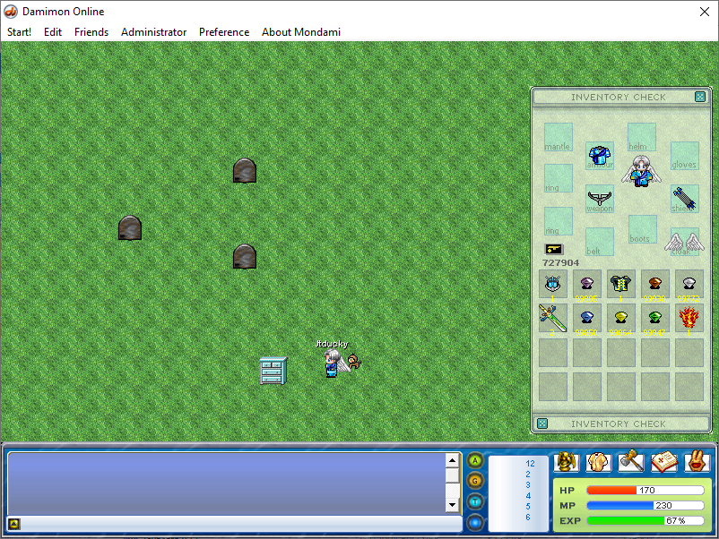

#### 02 World Editor
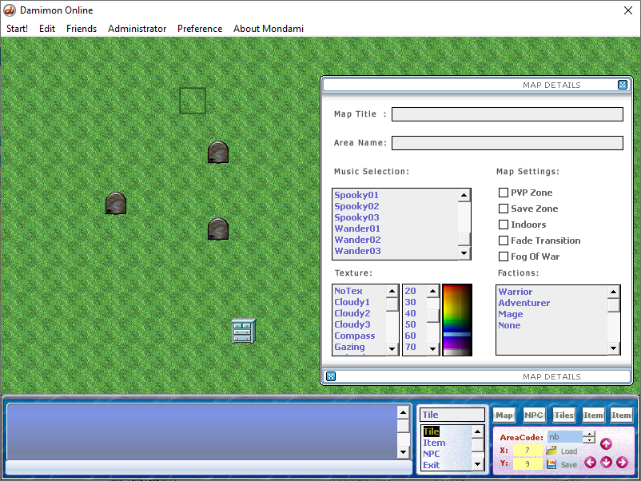

#### 03 Tile Editor
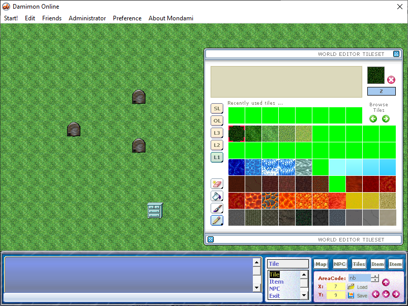

#### 04 Item Editor
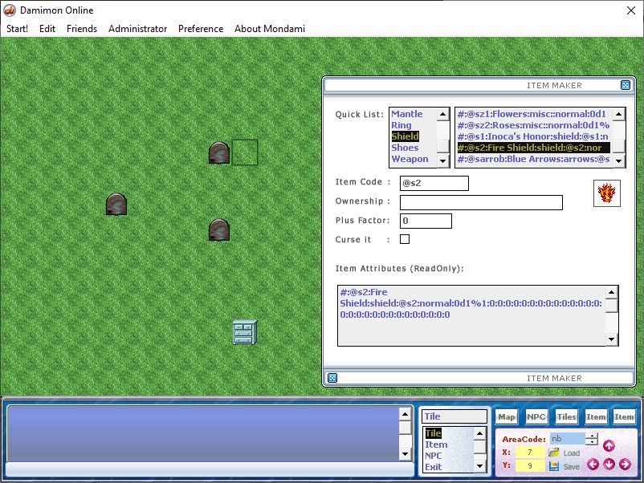

## Screenshots (v1.60)

Screenshots of v1.60, which is based of FSO engine. Rewrote the client to optimize sprite rendering & movements, as well as server scripts in Lingo.

#### 01 Login Screen 
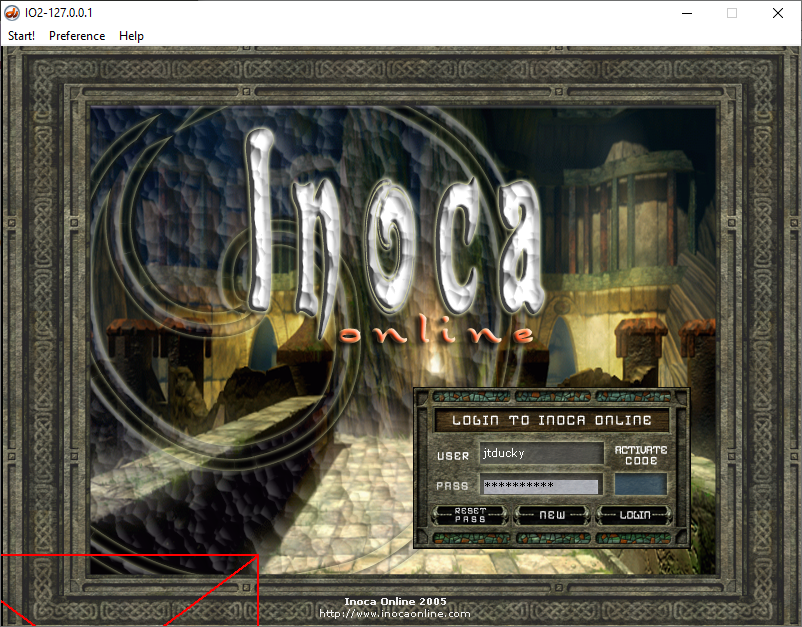

#### 02 Fishing Port 
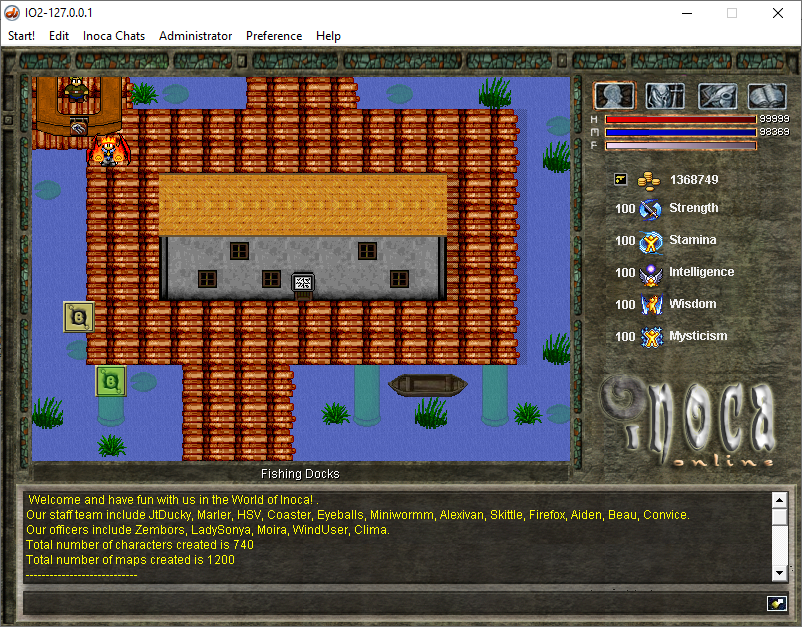

#### 03 Killing Slimes
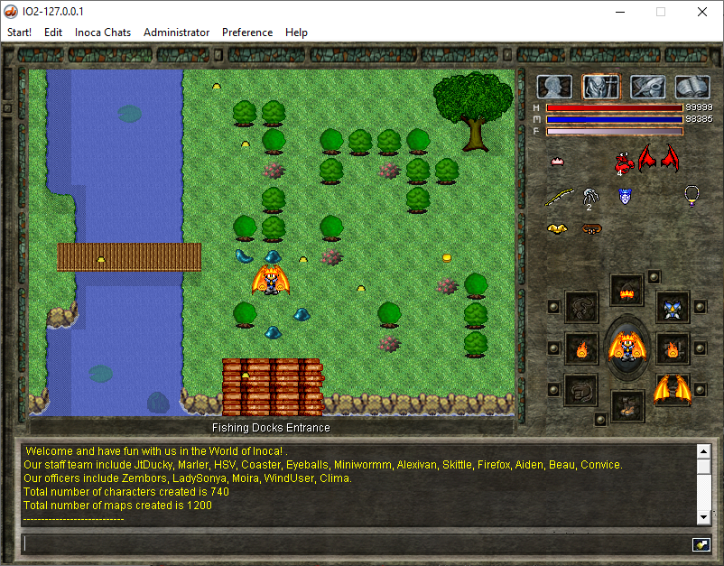

#### 04 World Editor
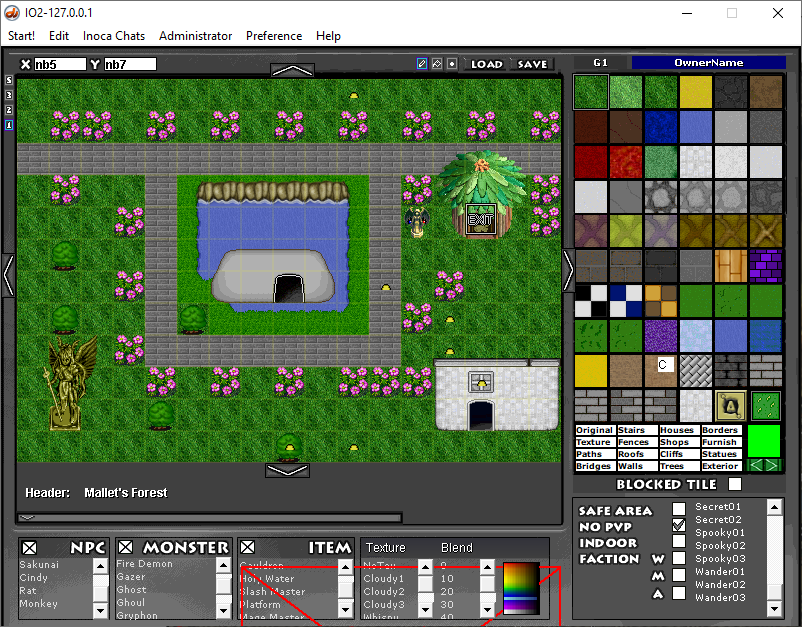

#### 05 Friends List
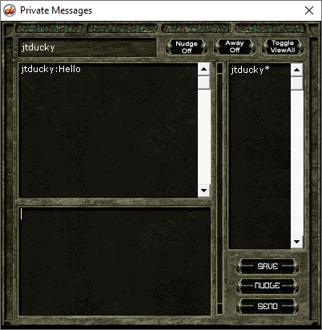

#### 06 Shop Keeper
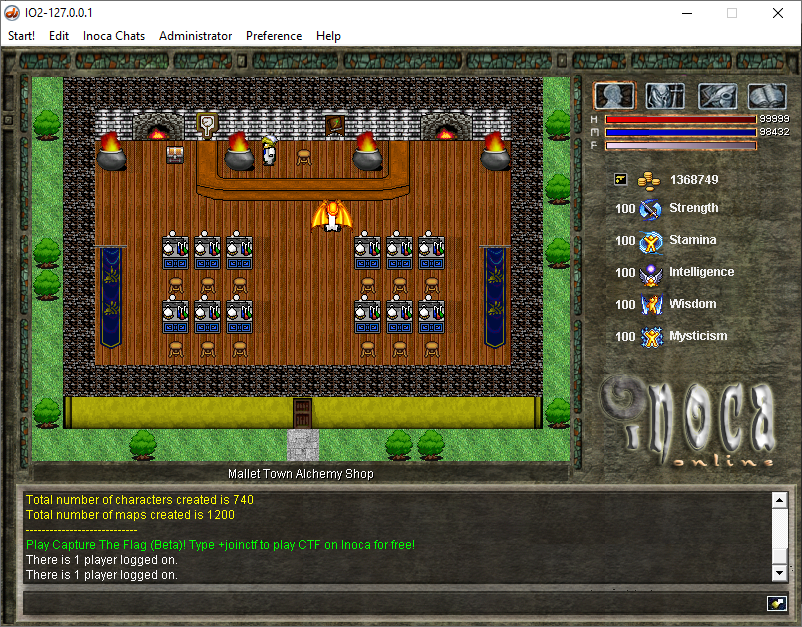

#### 07 Buy & Sell Stuff
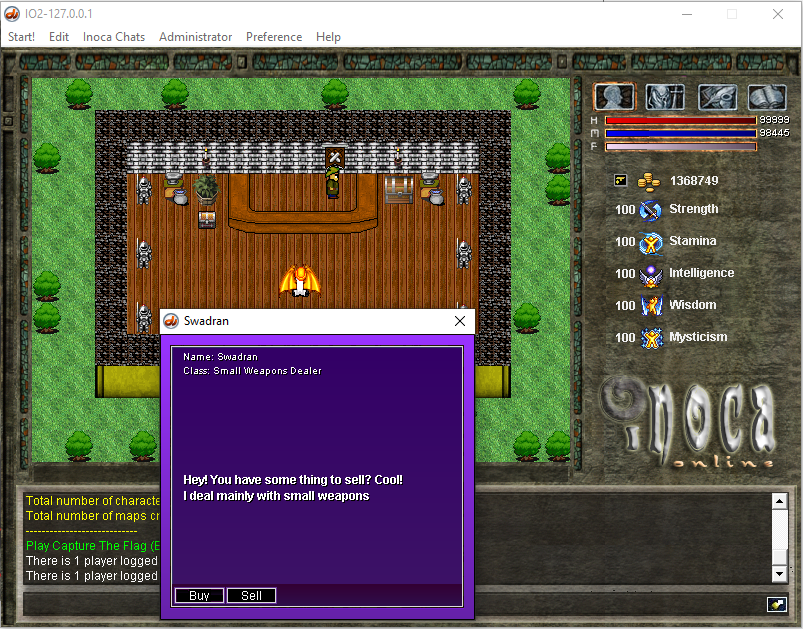

#### 08 Casino 
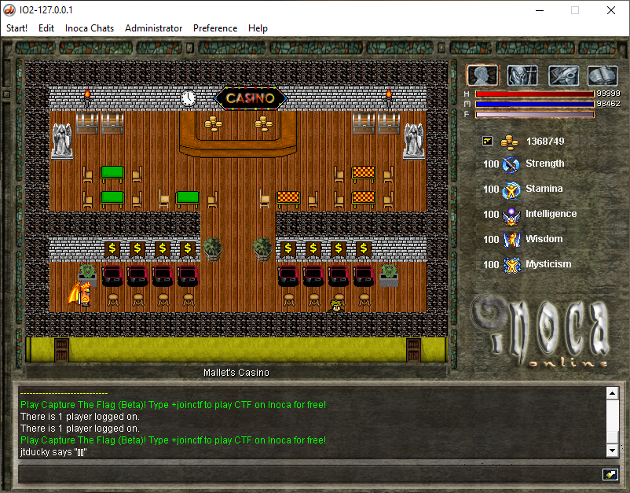

#### 09 Jail Time
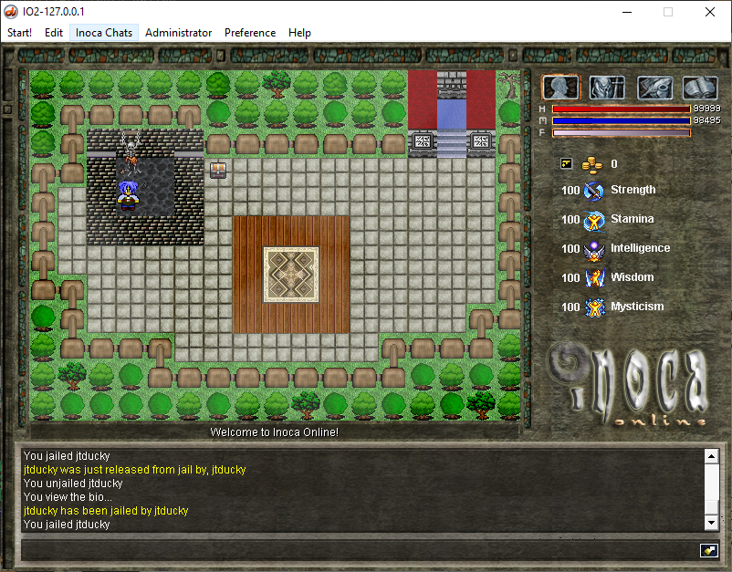

## Key Features
- Antihack
- World Editors
- Admin Features (@ban, @warp, @mute, @unmute, @jail, @filters etc)
- Trace Logging 
- Password reset via email
- Map Restrictions

## Game Play
- Social (Buddy List, World Chat, Private Messaging, Guilds)
- PVE/PVP
- Item Enchantment
- Monster Drops
- NPC Quests
- NPC Shops (buy/sell)
- Player Banking
- Player Housing
- Hundreds of Items
- Container storage
- Factions

## Game Events
- Marriage, Marriage Announcements
- Capture the flag
- Lottery
- Treasure hunt

## Player Skills 
- Fighting Skills
  - Archery
  - Axe Fighting
  - Block
  - Fencing
  - Hammer Wielding
  - Heavy Arms
  - Martial Arts
  - Parry
  - Punch
  - Slash 
  - Staff Fighting
  - Thrust
  - Unholy Combat
- Magic Skills
  - Black Arts
  - Blessing
  - Earth
  - Fire
  - Illusion
  - Magery
  - Sorcery
  - Water
  - Wind
  - Wizardry
  - Wrath
- Economic Skills
  - Alchemy
  - Blacksmithing
  - Carpentry
  - Carving
  - Cooking 
  - Farming
  - Fishing
  - Lumberjacking
  - Medicinal 
  - Mining
  - Musicianship
  - Sewing
  - Shoveling
  